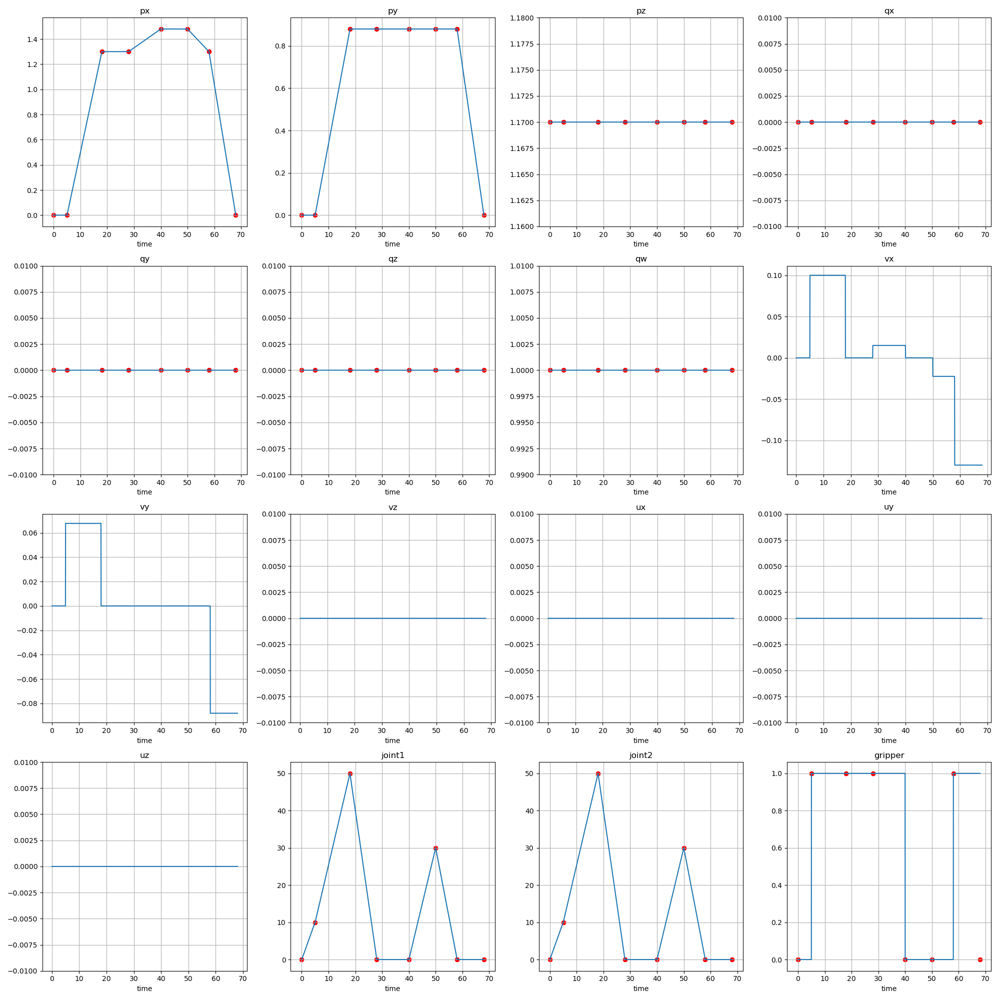

## EE-Centric Kinemactics Trajectory Tracking (IK)
```launch
roslaunch trajectory_controller ee_trajectory_controller.launch
```
We use the following global states to describe flight process:
```python
TAKEOFF = 1
PAUSE = 2
LAND = 3
FREEFLIGHT = 4
```
1. TAKEOFF: let the base move more, arm move less;
2. PAUSE: TODO
3. LAND: TODO
4. FREEFLIGHT: let the base move less, arm move more;

### IK from Xiaofeng
TODO
### IK from Yuanhang
- Motion ratio of base & arm
See `IKPlanner` in `planner/ee_ik_yh.py`:
  - Smaller `λxy` is, smaller arm movements in x-y axis are (Default: 0.1).
  - Smaller `λz` is, smaller arm movements in z axis are (Default: 0.05).

- EE Constraints on the height
See `IKPlanner` in `planner/ee_ik_planner.py`:
  - `pz_l` indicates the minimal vertical distance between ee and base (Default: 0).
  - `pz_u` indicates the maximal vertical distance between ee and base (Default: 0.8).

## Generate Trajectory
### generate fixed ee trajectory
```python
python src/traj_gen/traj_gen_from_ee_pose.py reference/test_ee.csv traj/test_ee.csv
# fill traj/test_ee.csv in lanch file
```
### generate fixed whole-body trajectory

all key frame are interpreted except **gripper is right-side zero-order holding** (see ax at the right buttom corner).

```python
python src/traj_gen_from_keyframe.py reference/test.csv traj/test.csv
# fill traj/test.csv in lanch file
# also save trajectory figure in traj/test.png
```

- Blue line: interpolated commands
- Red line: key frame

